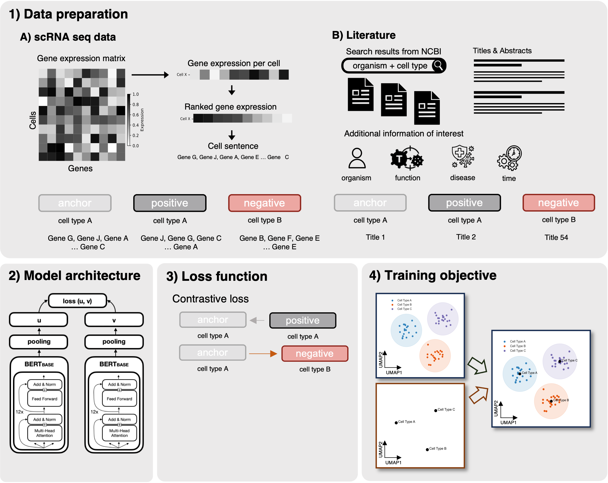

# ALIAS (Adding Layers of Information for the analysis of scRNA-seq data)

[](https://github.com/MariaKrissmer/alias/actions/workflows/test.yml)
[](https://www.python.org/downloads/)

This is a first version of the codebase corresponding to our PrePrint [(bioRxiv)](https://www.biorxiv.org/content/10.1101/2025.08.23.671699v1), where we show how small encoder-only language models can be used to generate a joint embedding space for scRNA-seq data with corresponding biomedical literature.



Please note that, as of now, not all evaluation functions shown in the PrePrint are implemented and the tutorials for using the repo are still WIP. We will have a ready to use repo within the next couple of weeks.

## Setup

```bash
# Clone the repository
git clone <repo-url>
cd alias

# Install dependencies using uv
uv sync

# Set up your Hugging Face tokens
cp .env.example .env
# Edit .env and add your actual Hugging Face tokens
```

### Environment Variables

The project requires Hugging Face tokens for accessing and uploading models/datasets. 

1. Copy the example environment file:
   ```bash
   cp .env.example .env
   ```

2. Edit `.env` and add your tokens:
   ```bash
   HF_TOKEN_DOWNLOAD=your_actual_token_here
   HF_TOKEN_UPLOAD=your_actual_token_here
   ```

3. Get your tokens from [Hugging Face Settings](https://huggingface.co/settings/tokens)

## Testing

The package is tested on Python 3.10, 3.11, 3.12, and 3.13.

To run tests locally:

```bash
# Run import tests
uv run pytest tests/test_imports.py -v

# Or with verbose output
uv run pytest tests/test_imports.py -vv
```

Tests run automatically on every push via GitHub Actions. 


