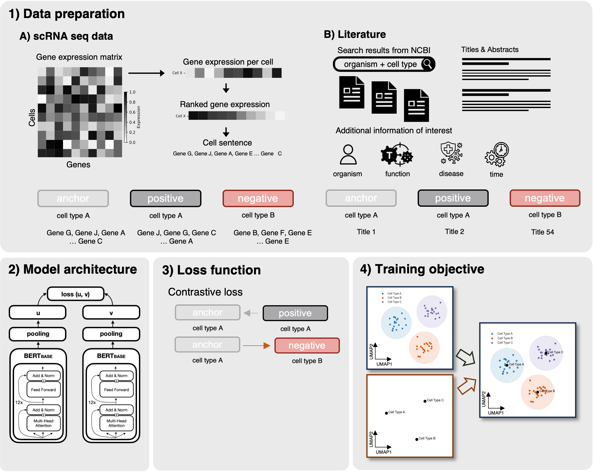

# alias (Adding layers of information for the analysis of scRNA-seq data)

[](https://github.com/MariaKrissmer/alias/actions/workflows/test.yml)
[](https://www.python.org/downloads/)

This is a first version of the codebase corresponding to our PrePrint [(bioRxiv)](https://www.biorxiv.org/content/10.1101/2025.08.23.671699v1), where we show how small encoder-only language models can be used to generate a joint embedding space for scRNA-seq data with corresponding biomedical literature.



This branch contains the public reproducibility workflows for the manuscript's HIAI T-cell ablation study. It covers the six ablation models (`MB`, `MJ`, `MG`, `MF`, `MH`, and `MI`) and the PubMedBERT baseline. LaManno, CMV, PBMC3k, LLM, and scIB workflows are maintained separately and are not part of this release.

No code in this branch may be changed without approval before the reproducibility release is finalized.

## Setup

```bash
# Clone the repository
git clone <repo-url>
cd alias

# Install dependencies using uv
uv sync --extra annotation --extra evaluation

# Set up your Hugging Face tokens
cp .env.example .env
# Edit .env and add your actual Hugging Face tokens
```

### Environment Variables

The project requires Hugging Face tokens for accessing and uploading models/datasets.

**Quick setup:**
```bash
cp .env.example .env
# Edit .env and add your actual Hugging Face tokens
```

📖 **For detailed configuration instructions, troubleshooting, and usage examples, see [CONFIGURATION.md](CONFIGURATION.md)**

## Reproducibility inputs and outputs

Raw HIAI data, generated datasets, model checkpoints, logs, credentials, and evaluation outputs are intentionally not tracked. Place the source HIAI `.h5ad` file under the project-local `out/` layout described by the scripts, and provide Hugging Face access through `.env` when using the published datasets or models.

The tracked provenance files are under [`reproducibility/`](reproducibility/):

- `manifests/model_registry.yaml` maps manuscript labels to canonical model IDs.
- `manifests/dataset_registry.yaml` maps dataset IDs to generation scripts and metadata.
- `manifests/query_manifest.csv` contains the NCBI query strings.
- `manifests/pmid_manifest.csv` contains the PMIDs used by the literature workflows.
- `manifests/ncbi_raw_pmid_manifest.csv` contains the PMID-only raw NCBI retrieval record before dataset-specific filtering.
- `manifests/split_manifest.json` contains the deterministic split indices and seeds.
- `metadata/` contains sanitized dataset and model metadata without machine-specific paths.
- `metadata/datasets/HIAI_Tcells/CL_raw_collection/` contains the raw Cell Ontology/scType term records used for CL-infused literature cell sentences.

## HIAI ablation workflows

The commands below are the selected public workflows. They are intentionally explicit about canonical IDs; manuscript labels are used only in the registry and presentation tables.

### Generate datasets

```bash
uv run python scripts/revision1_v1/HIAI_Tcells/dataset_generation/generate_N1_N3_ncbi_literature.py
uv run python scripts/revision1_v1/HIAI_Tcells/dataset_generation/generate_S2_heldout_donor_semantic_200k.py
uv run python scripts/revision1_v1/HIAI_Tcells/dataset_generation/generate_S3_heldout_donor_nonsemantic_200k.py
uv run python scripts/revision1_v1/HIAI_Tcells/dataset_generation/generate_S5_heldout_donor_semantic_shuffled_labels_200k.py
```

The NCBI script generates the N1 literature dataset and the N3 shuffled-literature control used in the ablation study. 

### Train models

```bash
uv run python scripts/revision1_v1/HIAI_Tcells/train_models/train_MB_S2_N1_200k_lr5e5.py
uv run python scripts/revision1_v1/HIAI_Tcells/train_models/train_MJ_S2_N3_200k_lr5e5.py
uv run python scripts/revision1_v1/HIAI_Tcells/train_models/train_MG_S2_200k_lr5e5.py
uv run python scripts/revision1_v1/HIAI_Tcells/train_models/train_MF_S3_200k_lr5e5.py
uv run python scripts/revision1_v1/HIAI_Tcells/train_models/train_MH_S5_200k_lr5e5.py
uv run python scripts/revision1_v1/HIAI_Tcells/train_models/train_MI_N1_200k_lr5e5.py
```

### Evaluate models

Run cell-type annotation with the selected ablation models:

```bash
uv run python scripts/revision1_v1/HIAI_Tcells/celltype_annotation/run_celltype_annotation.py \
  --models Base,MI,MF,MG,MB,MJ,MH
```

The generic checkpoint and downstream runners are available under `scripts/revision1_v1/HIAI_Tcells/`. They write generated artifacts under ignored `out/` directories and require the corresponding datasets, embeddings, and model checkpoints.

## Selected models

| Manuscript label | Description | Canonical model | Hugging Face |
|---|---|---|---|
| `MA` | HIAI donor-generalization ablation | `MB` | Publication pending |
| `MA*` | HIAI shuffled-literature control | `MJ` | Publication pending |
| `MB` | HIAI metadata contribution | `MG` | Publication pending |
| `MC` | HIAI non-semantic ablation | `MF` | Publication pending |
| `MC*` | HIAI shuffled-label control | `MH` | Publication pending |
| `MD` | HIAI literature-only model | `MI` | Publication pending |
| `Base` | PubMedBERT baseline | `neuml/pubmedbert-base-embeddings` | [model page](https://huggingface.co/neuml/pubmedbert-base-embeddings) |

## Getting Started

### Demo Notebook

Check out the complete training pipeline in our demo notebook:

```bash
# Place your demo data at data/demo.h5ad
# Then run the notebook
uv run jupyter notebook notebooks/demo_training_pipeline.ipynb
```

See [`notebooks/README.md`](notebooks/README.md) for more details.

## Testing

The package is tested on Python 3.11, 3.12, and 3.13.

### Test Suite

- **Import tests** - Verify all modules can be imported
- **Config validation** - Test configuration classes and defaults
- **Dependency integration** - Ensure package dependencies work together

To run tests locally:

```bash
# Run all tests (67 tests, ~3 seconds)
uv run pytest tests/ -v

# Run fast unit tests only (63 tests, ~2 seconds)
uv run pytest tests/ -v -m "not integration"

# Run integration tests with real data (4 tests)
uv run pytest tests/ -v -m integration

# Run specific test files
uv run pytest tests/test_imports.py -v
uv run pytest tests/test_configs.py -v
uv run pytest tests/test_integration_pipeline.py -v
```

Tests run automatically on every push via GitHub Actions. See [`tests/README.md`](tests/README.md) for details. 


